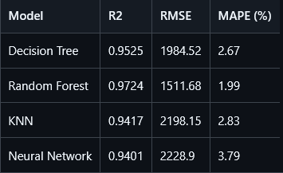

# consomption_prediction

## ***ETAPE 1 : prépararation  dataset final***
Voici les étapes à suivre afin de récupérer les données ( téléchargable depuis cet [URL](https://www.rte-france.com/donnees-publications/eco2mix-donnees-temps-reel/telecharger-indicateurs) ) afin de réaliser ce projet et comment procéder pour préparer le datset final.
1. Télécharger les fichiers RTE (2014-2025)
2. Lire les fichiers (**attention** ce n'est pas vraiment des fichiers excel)
3. Fusionner les fichiers
4. Garde que les colonnes : Date / Heure / Consommation (**Afin de construire un modèle de prédiction pertinent et facilement déployable, seules les colonnes Date, Heures et Consommation ont été conservées lors de la phase de préparation des données. Ces informations permettent de générer des variables explicatives temporelles (jour de la semaine, mois, week-end) ainsi que des variables historiques de consommation (J-1, J-7, moyennes mobiles), reconnues comme particulièrement pertinentes pour la prévision de séries temporelles. Les colonnes de prévision fournies par RTE ont été exclues afin d'éviter toute fuite d'information (data leakage), tandis que les autres variables de production énergétique n'ont pas été retenues dans le cadre de cette première approche afin de limiter la complexité du modèle et de faciliter son interprétation, sa maintenabilité et son déploiement, Les variables de production énergétique telles que le nucléaire, le gaz ou l'éolien n'ont pas été retenues car elles correspondent à des valeurs observées et ne sont pas nécessairement connues au moment de la prédiction. Afin d'éviter l'utilisation d'informations indisponibles en situation réelle, nous avons privilégié des variables temporelles et historiques directement accessibles lors de la prévision.**)
5. Nettoyer les données
6. Crée une vraie colonne datetime
7. Regroupe par jour
8. Calcule la consommation moyenne journalière
9. Crée des variables calendaires
10. Crée des variables historiques
11. Sauvegarde le dataset final 

## ***Etape 2 : entraînement de modèles*** 
On prépare le dataset journalier préparé, on entraîne plusieurs modèles de régression, on compare leurs performances sur un jeu de test puis on conserve le meilleur pour l'étape suivante de déploiement.
1. Charger le dataset final
2. Définir features et target
3. Découper les données train/test (80% train et 20% test)
4.  Définir les modèles de régression (arbre de décission, randomForest, KNN et MLPRegressor)
5. Faire une boucle pour entraîner chaque modèle, faire les prédictions; calculer R², calculer RMSE et finalement calculer le MAPE. 
6. Stocker les résultats de chaque modèle dans une structure
7. Transormer les résultats en dataframe
8. Sauvegarder les résultats dans le dossier *output*
9. ***exploration des résultats*** : 
    - Les résultats expérimentaux montrent que le modèle Random Forest est le plus performant parmi les modèles testés. Il obtient le meilleur coefficient de détermination (R² = 0,9724), ainsi que les erreurs les plus faibles en RMSE (1511,68) et en MAPE (1,99 %). Ces résultats montrent que le modèle offre à la fois une excellente capacité d’ajustement et une faible erreur de prédiction. En comparaison, l’arbre de décision, le KNN et le réseau de neurones présentent des performances inférieures. Le modèle Random Forest a donc été retenu pour la suite du projet, notamment pour son bon compromis entre précision, robustesse et facilité d’exploitation en production

        

10. Sauvegarder les résultats du ***Random Forest*** 
11. Sauvegarder le modèle

## ***Etape 3 : création API pour la prédiction*** 
Le modèle retenu, Random Forest Regressor, a été intégré dans une API REST développée avec FastAPI. L’API charge le modèle sauvegardé au format joblib et expose un endpoint /predict permettant de fournir les variables explicatives du jour à prédire et de retourner une estimation de la consommation journalière. Cette approche permet d’isoler le modèle dans un service réutilisable, testable et facilement déployable dans un conteneur Docker.

Une validation métier a été ajoutée à l’API afin d’éviter les prédictions produites à partir de données incohérentes ou non réalistes. Les contrôles portent notamment sur la cohérence entre le jour de la semaine et l’indicateur week-end, ainsi que sur les bornes admissibles des variables historiques de consommation. Cette validation améliore la robustesse du service et participe à la maintenabilité de la solution en production.

**uvicorn src.api:app --reload**

**docker build -t consumption-api .**
**docker run -p 8000:8000 consumption-api**